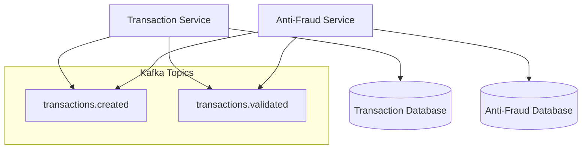

# TransactionManager
A microservices-based system for processing and validating financial transactions.

## Flow Diagram


## Prerequisites

Make sure you have the following installed on your system:

- [.NET 8.0](https://dotnet.microsoft.com/en-us/download/dotnet/8.0)
- [Docker Desktop](https://www.docker.com/products/docker-desktop)
- Git

## Getting Started

### 1. Clone the repository

```bash
git clone https://github.com/EverEcheverri/TransactionManager.git
cd TransactionManager
```

### 2. Start Kafka and Zookeeper

This project uses Kafka as the message broker. You can run Kafka and Zookeeper using Docker Compose:

```bash
docker-compose up -d
```

This will start:

- Zookeeper (port `2181`)
- Kafka (port `9092`)

> Asegúrate de que Docker esté corriendo antes de ejecutar este comando.

### 3. Restore dependencies

```bash
dotnet restore
```

### 4. Run the services

#### Run TransactionService

```bash
dotnet run --project TransactionService
```

#### Run AntiFraud.Worker

```bash
dotnet run --project AntiFraud.Worker
```

### 5. Verify everything is working

You should see logs indicating that the services are connected to Kafka and processing messages.

## Configuration

Each service reads its configuration from `appsettings.json`. Example:

```json
{
  "Kafka": {
    "BootstrapServers": "localhost:9092",
    "TransactionsCreatedTopic": "transactions.created",
    "TransactionsValidatedTopic": "transactions.validated"
  }
}
```

You can override these values using `appsettings.Development.json` or environment variables.


## Troubleshooting

- ❌ **Kafka connection error**: Make sure Docker is running and the Kafka container is healthy.
- ❌ **Topics not found**: Kafka will auto-create topics if configured properly. You can also use Kafka CLI tools or UI tools like Kafdrop.
- ❌ **Port conflict**: Ensure ports `9092` (Kafka) and `2181` (Zookeeper) are not being used by other applications.

## Future Improvements

- Add Docker support for the microservices
- Add retry logic and dead-letter queue
- Add health checks and observability
- Add integration and contract testing

